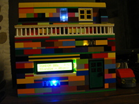

# ArduiPi Radio! :radio:
## FM / DAB+ / INTERNET (40 Presets + Random Mode) and MP3 Player...
###### *Powered by an Arduino Nano and a Raspberry Pi 3 Model B+*

   
   

###### Explanations, pictures & videos:
# :thumbsup:

   <A HREF="https://jjintokyo.github.io"><H1>https://jjintokyo.github.io</H1></A>

###### ...including other radio projects with OpenWrt and Armbian...
# :smiley:

   
   

# :notes:
